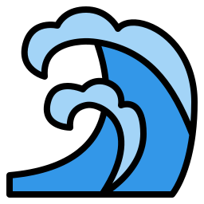

# The `Water` Programming Language 

## What is Water? 

Water is an optionally typed scripting language with syntax and language features inspired by Python, Rust, Julia, Gleam, Go, Javscript(yes really), and many more. It looks likes this:

~~~ python
my_func = () =>
    print("Hello world")
~~~

Water provides in-language shell scripting via specialised syntax, making the use of shell commands in scripts
more ergonomic than via standard library functionality.

~~~ python
/* 
    Everything after a $ is excecuted by a shell.
    A $ expression will evaluate to the stdout of the executed command.
*/

home_ls = $ls ~
for entry in home_ls.split(" ")
    $touch ~/{entry}/newfile.txt
~~~

Water also embeds a Python interpreter in its runtime. This enables direct use of Python libraries in Water-code.
The Python ecosystem is directly integrated through Water's module-system.

~~~ python
// This is a water import 
from display/printer import print as p

// This is a python import, python modules installed via pip are available
from Python.package import function as f

f()
print()
~~~
Water is garbage collected, not blazingly fast, and probably not a good choice for systems-, embedded-, vibe-, Java/large buisiness-, and many other types of programming. What Water does provide is a sleek and ergonomic language for everyday scripting.

## Design Philosophy

1. Aim to keep the syntax minimal, coheasive, attractive, and clear of noise:

    * No semicolons to end lines
    * No brackets to begin and end blocks
    * No ":" to begin blocks 
    * No "::" for path separation (I find it really ugly)
    * No separate "regular" and lambda functions
    * Make most language constructs expressions 
    * Use assignments as a universal way of defining variables, functions, types, etc.
    * Dont let the difficulty of parsing influence the grammar 
    * Try to keep the number of keywords as low as possible (within reason) 

2. Prefer dedicated syntax over library functions for key language features, partly since parenthesis clutter syntax. For example: 1..5 instead of range(1, 5), or run my_func() instead of thread.run(my_func).

2. Stay unopinionated about programming style (to an extent). Water will not tell the programmer how it should be written. Try avoiding the vibe of Java, Haskell, or parts of Rust to a lesser extent.

3. Provide a fast prototyping experience, and an opt in static typing for when your script grows larger. 

4. Piggyback of Pythons massive library ecosystem instead of attemting to remake the wheel and failing.
